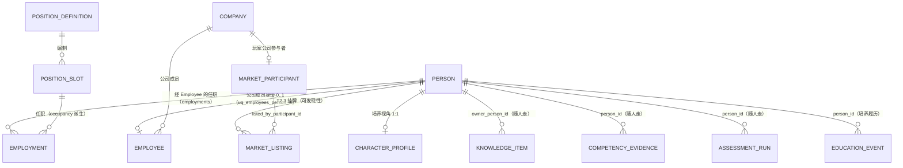
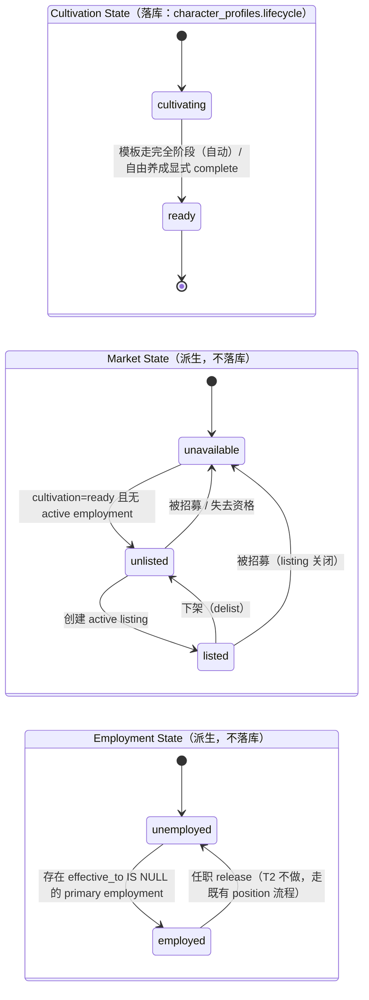

# T2 人才市场（本地模拟）领域设计

> 状态：**T2.0 Domain Contract Freeze 已冻结**（2026-09-10）。本文是 T2 的**领域语义唯一基线**；
> 工程执行基线见 [t2-implementation-plan.md](t2-implementation-plan.md)，路线图见
> [talent-ecosystem-plan.md](talent-ecosystem-plan.md) §3 T2，愿景见
> [talent-ecosystem-vision.md](talent-ecosystem-vision.md) §2/§6。
>
> 本文所有代码路径均以 audit 时的 repository 现状为准（HEAD `68ce65a`，迁移 head `a3b5c7d9e1f4`）。

---

## 1. 定位

T2 = **Talent Circulation / Local Talent Market（人才流通 / 本地人才市场）**。

**不是**商城，**不是**经济系统。T2 回答的问题是：

> 一个已经存在的 Person / Character，如何从培养系统进入人才市场，被浏览、筛选、评价，
> 并被某家公司招募，同时**完整保留**其身份、知识、人格、能力与历史证据？

T1（已完成）回答的是"一个人如何被培养"；T2 回答"这个人如何流动"。
经济（货币/合同/escrow）属 M1，联网市场属 M2 —— 两者都是 T2 的**下游**，不是 T2 的依赖。

## 2. 术语冻结（Terminology Freeze）

### 2.1 已冻结词表

| 术语 | 定义 | 载体 | 备注 |
| --- | --- | --- | --- |
| **Person** | 身份聚合根，"人本身" | `persons`（`app/models/person.py`） | 先于任职存在；slug 是唯一权威 |
| **Character**（角色） | Person 的**培养视角**档案（1:1） | `character_profiles`（`app/models/cultivation.py`） | 不是第二种"人" |
| **Talent**（人才） | 市场语境下"可被招募的 Person"，**是状态描述不是实体** | 无表（派生） | 禁止为此建表 |
| **Market Listing**（挂牌） | 表达"当前可被市场发现、且允许进入招募流程"的**资源** | T2.3 `market_listings` | 不是报单/出售要约 |
| **Market Participant**（市场参与者） | 发起挂牌/招募的主体 | T2.3 `market_participants` | 玩家公司 / NPC 公司 / 系统发行方 |
| **Recruitment**（招募） | 把**既有 Person** 变成某公司 Employee 的一次领域事务 | T2.6 `RecruitmentService` | 不复制数据 |
| **Employment**（任职） | Person 在某公司的职位关系 | `employments` = `PositionAssignment`（`app/models/position.py`） | 已存在，T2 不新建 |
| **Issuer**（发行方） | 系统角色：按周期投放 issued 角色 | T2.4 `IssuerService` | 复用培养引擎 |
| **Person Read Model** | Person 的统一读取投影（培养/市场/员工三处共享） | T2.1 | 禁止三套聚合逻辑 |

### 2.2 术语冲突裁定：不要用裸 `Candidate`

**Audit 发现**：`Candidate` 在仓库中已被占用，且语义不同——

- `app/services/candidate_analysis.py`（P9）：**Employee × Position** 的候选分析（`docs/candidate-analysis.md`）；
- `app/api/v1/position_candidates.py`：`GET /position-definitions/{id}/candidates`；
- 前端 `candidate-panel` / `candidate-bands.contract.test.ts`。

**裁定**：

1. `Candidate` **继续保持** P9 语义（公司内部职位候选），T2 不改其任何行为；
2. T2 市场语境统一用 **`listing`（挂牌）/ `listed talent`（在市人才）**，不用裸 `Candidate`；
3. API 路径不得出现 `/candidates`（避免与 P9 冲突），市场用 `/market/*`；
4. 中文文案：市场侧用「人才 / 在市角色 / 挂牌」，不用「候选人」（避免与职位候选混淆）。

## 3. 领域模型

### 3.1 实体关系



**一句话**：`Person` 是唯一的"人"；`CharacterProfile` 是培养视角；`Employee` 是公司任职视角；
`MarketListing` 只表达"可发现性"；`Employment`（`employments`）表达当前职位关系。

### 3.2 谁拥有什么（Ownership Semantics）

| 归属 | 内容 | 载体 | 招募时 |
| --- | --- | --- | --- |
| **Person（随人走）** | 身份 `identity_id`、命名、人格 traits、知识（private）、技能、记忆、能力画像、证据、评估 run、教育履历 | `persons` + 各域 `person_id` 列 | **不复制、不改写** |
| **CharacterProfile（培养期持有）** | `origin`、`owner_company_id`（nullable）、培养状态 | `character_profiles` | `owner_company_id` 可保持/更新，历史不清洗 |
| **Employee（公司成员身份）** | company/department/title、`lifecycle_status`、runtime/workspace 资源 | `employees` | 招募时**新建**，`person_id` 指向既有 Person |
| **Employment（当前职位关系）** | slot、生效区间、类型、状态 | `employments` | 招募时按需（显式指定职位才建行） |
| **MarketListing（可发现性）** | status、挂牌方、品质档、时间戳 | `market_listings`（T2.3） | 招募时关闭 |
| **公司资产（不随人走）** | 文档/drive/产物/项目 | 各域 | 不参与招募 |

### 3.3 Identity 语义

- `identity_id`（`CH-` + 12 位 Crockford，`character_profiles.identity_id` unique）**创建即终身不变**；
- 招募**禁止**新建 Person、禁止新建 CharacterProfile、禁止改写 `identity_id`；
- Person 身份在 DB 层由 `persons.id` + `persons.slug`（unique）保证；`identity_id` 是**对外**身份锚点（愿景 §6.1）。

## 4. 状态模型（三轴正交）

`character_profiles.lifecycle` 当前同时被当成"培养状态"和"市场/任职状态"的候选载体。
**裁定：一个 enum 不表达三个维度**（但也不为此立即重建 schema —— 采用最小演进）。

### 4.1 三轴定义



| 轴 | 取值 | 载体 | 写入口 |
| --- | --- | --- | --- |
| Cultivation | `cultivating` → `ready` | `character_profiles.lifecycle`（**只存这两值**） | T1 引擎（模板自动）/ T2.2（自由养成显式结业） |
| Market | `unavailable` / `unlisted` / `listed` | **派生**：active listing 存在性 + cultivation + employment + **是否已被市场消化**（T2.7c） | T2.3（挂牌/下架）/ T2.6-T2.7c（招募） |
| Employment | `unemployed` / `employed` | **派生**：`employments` 有 `effective_to IS NULL` 的 primary 行 | 既有 `position_service.assign_position/release_position` |

**废弃声明**：`character_profiles.lifecycle` 的 `listed` / `hired` 两个"预留值"**不再使用**
（T1 文档中的预留作废）。市场态与任职态各走自己的载体，避免同一列被三个语义争用。
迁移计划：不删列、不改值域（现网只有 `cultivating`/`ready`），仅在 T2.2 起由 `CultivationState`
约束写入；如未来需要，再做值域收窄迁移。

### 4.2 组合合法性

| cultivation | market | employment | 含义 |
| --- | --- | --- | --- |
| `cultivating` | `unavailable` | `unemployed` | 培养中（不可挂牌） |
| `ready` | `unlisted` | `unemployed` | 养成完成、未挂牌（可挂牌） |
| `ready` | `listed` | `unemployed` | **在市场**（可被浏览/筛选/招募） |
| `ready` | `unavailable` | `employed` | 已入职（listing 已关闭） |
| `ready` | `unlisted` | `employed` | 已入职但从未挂牌（留用路径） |

非法组合（必须被拒绝）：`cultivating + listed`、`listed + employed`（同一 Person 同时"在市"且"在职"）。

## 5. 历史 Provenance（不可改写）

**冻结**：

```
HistoricalCompanyContext  ≠  CurrentOwnership  ≠  CurrentEmployment
```

- 历史 = 事实发生时的上下文快照，**招募后不得批量改写**；
- 当前所有权/当前公司关系只能由**另外的实体**表达（`character_profiles.owner_company_id`、
  `employees.company_id`、`employments`），不得回写历史。

audit 事实：

| 字段 | 语义 | T2 动作 |
| --- | --- | --- |
| `assessment_runs.company_id` | 评估发生时的公司上下文快照（模型注释明确"与人称切换无关，不动"） | **不动** |
| `competency_evidence.environment` | 证据产生环境（education/mock/…）；该表**无 company_id** | 不动 |
| `education_events` | 只有 `person_id`，无公司列 | 不动 |
| `knowledge_items.owner_person_id` | 知识属主（随人走）；无 company_id 列，公司归属经 owner/department 派生 | 不动 |
| `learning_sessions.company_id` | 公司快照（R1.1 已裁定"非镜像"） | 不动 |

## 6. 市场可见性策略（Market Visibility）

**冻结**：普通业务 API 继续遵守 company isolation（`app/api/scope.py::resolve_company_id` +
repository 层强制）；**Market 是唯一的跨公司读取域**，且必须通过自己的 policy 与读路径实现，
**不得为使市场可读而放宽既有 repo 的 company 过滤**。

### 6.1 公开投影白名单（listed Person 才可读）

| 可公开 | 字段/来源 | 说明 |
| --- | --- | --- |
| 身份 | `identity_id`、`name`、`avatar`、`origin`、`cultivation_state` | 来源 `persons` + `character_profiles` |
| 履历 | `education_events`（kind/topic/outcome 公开字段/occurred_at） | 培养期叙事 |
| 人格 | traits 8 维（code/label/display） | 只读，不带能力语义 |
| 能力画像 | competency summary：`score` + `confidence` + `evidence_count` + `last_assessed_at`（未评估 = null） | **score 与 confidence 同等视觉权重** |
| 证据 | `competency_evidence` 公开字段：`source_kind`、`signal`、`occurred_at`、`observation`、挂载的 competency | 履历=证据链，支持下钻 |
| 知识摘要 | `topic` + `scope` + `count`（**不含正文**） | 正文在招募后可读（private 随人走） |
| 挂牌信息 | listing status、quality_tier、listed_at、participant 显示名 | T2.3 |
| Fit | 对某职位的匹配：score / confidence / coverage / missing / 逐项评估状态 | T2.5；**不含** inputs_hash 与 owner id |

### 6.2 明确不公开

`credential`/`credential_mask`、provider 与 runtime 配置、`memory_entries`、
私信 `messages`、公司文档/产物（drive/artifacts）、项目与任务、`assessment_runs.inputs_hash`
等审计字段、`users`/认证信息。

### 6.3 实现纪律

- Market 读路径：`MarketReadService`（T2.3）→ 专用 repo 查询（只按 `active listing` 的 person_id 取数）
  → **显式字段投影**，禁止直接复用 `employee_capabilities_out` 之类的公司内读面；
- Market 写路径：`MarketService` → `MarketAdapter`（T2.3）；
- 任何 market 模块**不得**为了读别的公司数据而调用 `list_*` 类公司作用域 repo。

## 7. 领域决策（Domain Decisions）

| # | 决策 | 内容 | 依据 |
| --- | --- | --- | --- |
| **D1** | 结业口径 | 模板末阶段完成 → 自动 `ready`；自由养成 → **玩家显式 finalize** → `ready`。**禁止**用 competency/confidence/经历数量阈值作为结业条件 | 用户裁定 1；市场价值在于买方自行判断 |
| **D2** | 挂牌含义 | `listing` 只表示"可被市场发现且可进入招募流程"，**不是**报单/报价/出售/竞拍。T2 无真实交易 | 用户裁定 2 |
| **D3** | 防篡改范围 | 沿用 `inputs_hash` + 证据链作为溯源；T2 **不做**哈希链/防伪体系（留给 M2） | 用户裁定 3 |
| **D4** | 市场作用域 | Market 是受控的跨公司读取域，由 market policy 显式放行；普通 API 的 company scope 保持不变 | 用户裁定 4 |
| **D5** | Provenance 不可改写 | 见 §5 | 用户裁定 5 |
| **D6** | 三轴状态分离 | 见 §4；`character_profiles.lifecycle` 只存培养态 | 用户 §5 |
| **D7** | 招募审计复用既有实体 | 招募审计 = `career_events(event_type=joined)` + bus 事件 `person.recruited` + listing 关闭字段；**不新建** `recruitment_events` 表 | audit：`career_events` 已有 `employee_id` + `joined` 枚举，重建同义表违反"单一事实" |
| **D8** | 市场参与者用独立表 | 新增 `market_participants`（kind=player_company/npc_company/system_issuer）；NPC 公司**不写进 `companies`** | audit：`companies` 无 kind 列，且被 employee/drive/项目等大量外键引用；NPC 入 companies 会污染公司作用域读面 |
| **D9** | `recruit` 不属于 MarketAdapter | Adapter 管市场资源（挂牌/下架/查询）；`recruit` 属 `RecruitmentService`（编排：listing 校验 + employee + employment + 事件） | 用户推荐；避免把"领域事务"塞进"资源适配器" |
| **D10** | 无经济依赖 | T2 代码不得出现 wallet/ledger/price/escrow 等 M1 概念；有守卫测试 | 用户 §十一/§十八D |
| **D11** | `issued` 走真实培养 | 发行方角色必须经 `advance_program` 真实产出证据，品质档位只影响**参数与概率分布**，不直接写能力分 | 用户 §十二；概念架构 §4 规则 3 |
| **D12** | 招募不复制人级资产 | 见 §3.2；有守卫测试 | 用户 §3.1 |
| **D13** | 发行方上下文（T2.4） | issued 角色**生下来就在市场**：`character_profiles.owner_company_id = NULL`（T1 语义）；评估需要非空公司上下文，由 `IssuerService` 显式传入**本部署默认公司**作**历史快照**（仅 provenance — 不产生所有权，`/persons/*` 不因此可读；招募后也不回写，I5）。引擎侧唯一接口：`advance_program(assessment_company_id=...)`；玩家路径不传，行为与 T1 逐值一致 | audit：`assessment_runs.company_id` NOT NULL；市场供给无公司行 |

## 8. MarketAdapter 契约

### 8.1 职责边界

```
Application Service（T2.3 MarketService / T2.6 RecruitmentService）
        ↓
MarketAdapter（Protocol）        ← 市场资源：挂牌 / 下架 / 查询
        ↓
LocalMarketAdapter（T2.3）        ← 本地实现（SQLAlchemy）
        └── RemoteMarketAdapter（M2，可选）
```

- **Adapter 负责**：市场资源的增删查（listing 与在人才档案索引）；
- **Adapter 不负责**：招募事务（D9）、可见性策略（由 service 层 policy 决定）、
  人员档案内容（由 T2.1 Person Read Model 提供）。

### 8.2 接口（代码冻结于 `app/talent/market/adapter.py`，词表/DTO 在 `contracts.py`）

```python
class MarketAdapter(Protocol):
    def list_candidate(self, db, *, person_id, listed_by_participant_id, quality_tier=None) -> MarketListingView
    def delist_candidate(self, db, *, person_id, reason="") -> bool
    def get_listing(self, db, listing_id) -> MarketListingView | None
    def get_listing_for_person(self, db, person_id) -> MarketListingView | None
    def search_listings(self, db, query: MarketSearchQuery) -> list[MarketListingView]
```

同步签名（本地 T2 与项目 sync service 层一致）。**M2 若需异步**：新增 `AsyncMarketAdapter`
Protocol 由远端实现，**不修改**本契约。

**T2.3 落地形态**（已实现）：

- `app/talent/market/local_adapter.py::LocalMarketAdapter` 实现本 Protocol（只做市场资源）；
- `MarketService` = `app/services/market.py`：挂牌/下架编排（资格 → 适配器 → 事件），
  另向 T2.6 暴露 `close_listing_for_recruitment`（**不 commit**，招募事务内共用）；
- 枚举唯一家在 `app/models/enums.py`（`MarketListingStatus` / `MarketParticipantKind`，
  模型与迁移要 import 它们）；`contracts.py` 保持 T2.0 冻结的导入路径（re-export）；
  `MarketState`（派生视图）仍在 contracts；
- 公开投影 = `app/talent/market/read_model.py`：**显式字段选择**（不是序列化整个 ORM），
  履历 outcome 经 `PUBLIC_OUTCOME_KEYS` 白名单（去掉 `session_ids` 等内部引用），
  证据取 `PUBLIC_EVIDENCE_KEYS`（保留 `source_ref`/`assessment_run_id` 供验收 A 下钻）；
  索引级列表投影不含 traits/competency/evidence（那些在详情，避免 N+1）；
- `eligibility.market_state` 已接入 active listing：有行 ⇒ `listed`，否则按前两轴
  `unlisted` / `unavailable`（调用方零改动 —— T2.2 预留的单点已生效）。

### 8.3 记录与查询（只读契约，`app/talent/market/contracts.py`）

- `MarketListingView`：`listing_id`、`person_id`、`identity_id`、`name`、`origin`、
  `cultivation_state`、`status`、`quality_tier`、`listed_by_participant_id`、`listed_at`、`closed_at`；
- `MarketSearchQuery`：`text`、`origin`、`quality_tier`、`position_definition_id`（T2.5 起生效：
  附 Fit 摘要 + 排序）、`listed_by_participant_id`（T2.7a：「我的挂牌」）、`limit`（`None` = 不分页）、`offset`。

**不含** traits/competency/evidence —— 那些由 Person Read Model（T2.1）提供，避免两套聚合。
`MarketListingView` 的字段集是**公开投影的一部分**，变更需走设计文档评审。

## 9. Person Read Model（T2.1 契约方向）

- 统一投影：`identity` / `resume timeline` / `traits` / `competency summary` / `evidence` /
  `knowledge summary`；
- 消费者：Cultivation UI、Market UI、Employee UI **共用**，禁止三套聚合；
- 语义铁律：无证据 → `null` / `unevaluated`（**禁止 0**）；`score` 与 `confidence` 并列同权；
  trait 不参与任何能力换算（概念架构 §4 规则 4/10）；
- 载体：`app/talent/person/`（T2.1 建包）+ `PersonReadService`，读路径可复用 T1.3 已有的
  `services/traits.py::person_traits_out`、`services/competency.py::person_capabilities_out`。

**T2.1 落地形态**（已实现）：

- `app/talent/person/read_model.py`（= 文档里的 `PersonReadService`，模块级读函数）：
  `person_profile` / `timeline_out` / `evidence_out` / `identity_out`；
- `app/talent/person/access.py`：**自有 person 判定** —— `character_profiles.owner_company_id == 请求公司`
  （培养期持有）**或** 该 person 在本公司有 employee 行（在职）；否则 404（不泄露存在性）。
  市场（跨公司公开投影）**不**走这里（T2.3）；
- API：`GET /persons/{id}`（identity/traits/competencies/knowledge 恒在，`include=timeline,evidence`
  才附带大集合）+ `GET /persons/{id}/timeline|evidence`（分页，避免 chatty）；
- 知识摘要形状 `{total, by_scope, top_topics}` **同时供 T2.3 市场投影复用**，永远不含正文。

## 10. 不变量清单（可测试）

| # | 不变量 | 测试落点 |
| --- | --- | --- |
| **I1** | Person 身份稳定：招募不改 `persons.id` / `slug` | T2.6 |
| **I2** | `identity_id` 跨招募不变 | T2.6 |
| **I3** | Employee 必须引用既有 Person（招募路径不新建 Person） | T2.6 |
| **I4** | 招募不复制人级资产（knowledge/traits/evidence/assessment/education/knowledge） | T2.6 |
| **I5** | 历史 provenance 不可改写（`assessment_runs.company_id` 等） | T2.6 |
| **I6** | 只有 eligible 的 Person 才能挂牌（`cultivation=ready` 且无 active primary employment） | T2.2/T2.3 |
| **I7** | 只有 active listing 才能被市场招募 | T2.6 |
| **I8** | 一个 Person 不能出现冲突的 active primary employment（`uq_employment_employee_primary`） | 既有约束 + T2.6 |
| **I9** | 市场可见性不绕过无关公司私有数据（仅公开投影） | T2.1/T2.3 |
| **I10** | M1 经济实体不是 T2 的依赖（代码守卫） | T2.0 guard |
| **I11** | `character_profiles.lifecycle` 只含 `cultivating`/`ready` | T2.0 enum + T2.2 |
| **I12** | 能力分只能由聚合器写（含市场/发行路径） | 既有 app 级守卫（`test_competency_guards.py`） |
| **I13** | **person-only 行与 employee 行可并存**（培养期产生的 `employee_id IS NULL` 行 + 招募后的 employee 行）：所有 person 口径读面必须能处理这类行，不得假设“双写两列必有一 employee” | T2.2 回归（`test_roster_api.py`）＋ T2.6 复查 |

## 10b. 发行方（T2.4 落地形态）

- `app/talent/market/issuer.py`：`IssuerService.issue(...)` —— 建角色（`origin=issued`，
  `owner_company_id=NULL`）→ 按档位跑满培养实例（`advance_program` 循环至 completed，
  评估节点自动触发）→ `market_service.list_for_participant`（participant = `system_issuer`）
  → 事件 `market.listed`（不新增 `market.issued` 同义事件）；
- 档位（`TIERS`，**发行参数契约**）：`normal` = vocational；`fine` = academic + 参数
  （signal+5 / 际遇权重 1.25 / 覆盖 +1）；`rare` = academic+vocational 双履历 + 更高参数
  （signal+10 / 1.5 / +1）。**只影响采样分布，不写能力分**（有 AST 守卫）；
- 培养参数载体：`training_programs.metadata_json`（v30）→ `CultivationParams`
  （`signal_bonus` / `fortune_weight` / `intensity_bonus`，越界夹取、未知键忽略、
  默认值 = 与 T1 逐值一致）；
- 触发：CLI `scripts/issue_talent.py` + `make market-issue ISSUE_ARGS="--tier rare --count 2"`
  （不做发行 UI —— 属 T2.7）；
- 玩家端点 `POST /cultivation/characters` **仍拒绝** `origin=issued`（玩家不能自铸官方角色）。

## 10c. Fit（T2.5 落地形态）

- **一套引擎两个入口**：`talent/fit/engine.py::_calculate(owner=FitOwner(...))` 是唯一核心；
  `calculate(employee_id=…)` 与 `calculate_for_person(person_id=…)` 都只是入口适配
  （员工入口行为逐字不变，既有 24 条 P8 测试全绿）；
- **owner 口径 person 优先（R1 延续）**：`FitOwner.hash_payload` 在 person 可解析时只吃
  person —— 同一个人的两条路径产出**同一个 `inputs_hash`**（实测对拍相等）；
  employee_id 只在 person 解析不到时回落参与（legacy 行）；
- 能力行读法：员工路径保持 `read_criterion`（person 优先 + 旧口径回落）；
  person 路径直接按 `person_id` 读（市场候选人没有 employee 行）；
- **市场公开投影**（`talent/market/read_model.candidate_fit_out`）：score / confidence /
  coverage / missing / 逐项评估（`candidate_score` 命名）齐全；
  **不含** `inputs_hash`、owner id、`requirement_id`、`competency_definition_id`；
- 市场搜索带 `position_definition_id`：为每位在市候选人附 Fit **摘要** + 按匹配度排序
  （有分在前、未评估在后），**从不筛人**（Unknown != Bad）；该路径需要全量再切片，
  因此 `MarketSearchQuery.limit = None` 表示不分页（契约已标注）；
- 非 active 挂牌 / 别家公司职位 / 未知职位 → 404（不泄露存在性）。

## 10d. 招募（T2.6 落地形态）

- `app/services/recruitment.py::RecruitmentService.recruit_existing_person`：
  `CAS 关闭 listing（条件 UPDATE rowcount）→ 创建 Employee(person_id=既有) → 回填 listing.recruited_* →
  （可选）position_service.assign_position(commit=False) → career_events(joined) + audit →
  COMMIT → 发布 person.recruited（+ 分配过职位时补发 employee.position_assigned）`；
- `position_service.assign_position` 新增 `commit: bool = True`（`False` = 不 commit、不发事件，
  调用方持有事务边界并在提交后补发）—— 与 `assess_person_competencies(commit=False)` 同一约定；
- **角色镜像列**（`employees.role`，deprecated）的写入点从"招聘 + 种子"扩到"招聘 + 种子 + 招募"：
  招募与 `lifecycle.onboard` 同属入职路径，`position_compat` 的撤列口径不变（架构守卫已显式登记）；
- **知识读路径修复（R5，验收 B 的关键）**：`repositories/knowledge.list_knowledge_items` 的公司过滤
  原先只 join `owner_employee_id`（镜像列），**人级行**（培养期 person-only 行）会被整行过滤掉 ——
  "招募后立即携带培养期知识参与检索"因此不可能成立。现补一支 person 口径：
  `owner_person_id → 当前在职行`（`uq_employees_person_id` 保证至多一条），
  公司边界仍由"在职公司的知识"同一条规则判定；scope 过滤不变（private 行不会出现在
  department/company scope 查询里，隔离测试钉住）；
- 招募失败语义：未知 listing → 404；已关闭/重复/并发 → 409 `listing_not_active`；
  人已有生效主职 → 409 `already_employed`；别家公司部门/编制 → 404（不泄露存在性）；
  失败**不留半个员工**（显式 rollback）；
- 不做：runtime/provider 全链开通（沿用既有员工 runtime 流程）、owner_company_id 改写
  （历史持有方保留，当前关系由 Employee/employments 表达 —— D5/I5）。

## 10e. NPC 市场参与者（T2.7c 落地形态）

- **身份**：`market_participants(kind=npc_company, company_id=NULL)` —— NPC **不进 `companies`**
  （D8），也**不建 Employee**（没有公司行就不伪造员工行）；
- **招聘标准**：每个 NPC 有一个**全局职位模板**（`position_definitions.company_id IS NULL`，
  `template_scope=system`）+ 已发布画像版本（含能力门槛），与公司职位同构、只是不属任何公司；
- **选拔**：复用同一个 Fit 引擎（`fit_service.calculate_person_fit`）；阈值是
  **分数与置信度并列**达标（`min_fit_score` / `min_fit_confidence`，绝不用混合总分），
  `Unknown != Bad`：证据不足者只是落选，不会被"当成最差"买走；
- **成交**：CAS 关闭挂牌（`close_reason='npc_recruited'` + `recruited_participant_id`）+ 事件
  `market.candidate_taken`（person/identity/listing/participant/分数与置信度）—— 玩家可感知
  "某人才已经被其他公司招募"；`dry_run` 只报告不写库；
- **派生语义**：凡存在"招募式关闭"的挂牌（`recruited_company_id` 或 `recruited_participant_id`
  非空）⇒ 该 person 市场态 `unavailable`、`can_list` 原因 `consumed`（不可再挂牌）；
  仅 `delist` 不算消化，仍可重新挂牌；
- **节奏**：`make market-npc NPC_ARGS="--npc xinghai --dry-run"`（CLI 手动跑一轮；调度器属后续）。

## 10f. T2 冻结清单与交接（T2.8，2026-09-11）

**已交付且冻结**（改动需设计评审）：

| 层 | 承载 | 入口 |
| --- | --- | --- |
| 领域契约 | `talent/market/{contracts,adapter}.py`、`eligibility.py` | 词表 / Protocol / 三轴资格 |
| 资源 | `market_participants` + `market_listings`（迁移 v29/v31） | `LocalMarketAdapter` / `MarketService` |
| 公开投影 | `talent/market/read_model.py` | `/market/listings`、`/market/listings/{id}` |
| 人员读面 | `talent/person/` | `/persons/*` |
| Fit | `talent/fit/engine.py`（单入口 + `calculate_many_for_persons` 批量） | `/persons/{id}/fit`、`/market/listings/{id}/fit` |
| 招募 | `services/recruitment.py` | `POST /market/listings/{id}/recruit` |
| 发行 | `talent/market/issuer.py`（三档参数） | `make market-issue` |
| NPC | `talent/market/npc.py` | `make market-npc` |
| 结业 | `services/cultivation.complete_cultivation`（含 `cultivation_final` 评估） | `POST /cultivation/characters/{id}/complete` |
| UI | `pages/market/*` + `components/market/*` | `/market`、`/market/:listingId` |

**已知边界（有意不做，均已在文档登记）**：

- **M1（货币/合同/escrow）**：市场无价格、无报单、无结算；有代码守卫（迁移/模型/API/市场模块 AST）。
- **M2（联网市场）**：`MarketAdapter` 已抽象但只有本地实现；异步远端需另立 `AsyncMarketAdapter`，不改本契约。
- **NPC 成交后无回流**：被 NPC 买走的人在本部署离场（无公司/员工行，`consumed` 不再可挂牌）；
  换公司/自由身属 M1/M2 产权模型。
- **批量 Fit 不支持显式画像版本**（`calculate_many_for_persons` 用 ACTIVE；单入口支持任意版本）。
- **R1 镜像列**：推迟拆除（`person-core-migration.md` §7 已记评估结论）。

**交接提示**：新 Agent 从 `t2-implementation-plan.md` §16（Progress）与本文 §10a–§10f 恢复上下文；
每条不变量都有对应测试（`test_market_contract / _core / _eligibility / _npc / _issuer / test_person_fit /
 test_recruitment / test_t2_golden_path / test_t2_hardening`）。

## 11. 与 M1 / M2 的边界

| | 内容 | 归属 |
| --- | --- | --- |
| 挂牌可发现性、浏览、Fit、招募、NPC 对手方 | T2 |
| Wallet / LedgerEntry / 余额 / 货币 / 价格 / 报价 / 订单簿 / escrow / 支付 / 结算 / TradeContract | **M1**（T2 代码禁止出现，D10） |
| 联网撮合、身份注册中心、远端适配、反作弊 | **M2**（T2 只预留 `MarketAdapter` 抽象） |

## 12. 与既有架构的映射（复用 / 不改）

**复用**：

- 事件循环形状（概念架构 §2.3）：`事实 → bus.publish → 幂等消费者`（`app/events/bus.py`，
  同步发布、events 表 + WS；`actor_employee_id` 由 bus 统一解析 person 镜像）；
- 任职真相：`employments`（`PositionAssignment`）+ `position_service.assign_position/release_position`；
- 编制/占用派生：`OccupancyStatus`（ADR-2）与 `WorkforceStatus`（ADR-4，均不落库）；
- 证据/评估：`competency_evidence` → `services/competency.py` 聚合器（唯一写分方）；
- 培养引擎：`app/talent/cultivation/engine.py`（T2.4 发行方复用，不建第二套生成器）；
- 读面既有出口：`services/traits.py::person_traits_out`、`services/competency.py::person_capabilities_out`。

**明确不改**（T2 期内）：

- `/api/v1/employees/*` schema（R1 D7：兼容期零改动）；
- P9 `candidate_analysis` / `position_candidates` 的语义与端点；
- R1 遗留镜像列（`docs/person-core-migration.md` §7：等 T2 稳定后再评估拆除）；
- company scope 的既有实现（`resolve_company_id` + repo 层强制）；
- `positions`/`position_slots`/`employments` 的既有 ADR（不新建第二套任职真相）。

## 13. 后续阶段索引

| 阶段 | 主题 | 详见 |
| --- | --- | --- |
| T2.0 | Domain Contract Freeze | 本文 + `t2-implementation-plan.md` §4.1 |
| T2.1 | Person Read Model / Person API | plan §4.2 |
| T2.2 | Cultivation Completion & Market Eligibility | plan §4.3 |
| T2.3 | Market Core & MarketAdapter | plan §4.4 |
| T2.4 | Issuer & Market Supply | plan §4.5 |
| T2.5 | Person-scoped Fit Engine | plan §4.6 |
| T2.6 | Recruitment / Existing Person Onboarding | plan §4.7 |
| T2.7 | Market Experience & NPC Participants | plan §4.8 |
| T2.8 | E2E / Hardening / T2 Freeze | plan §4.9 |
